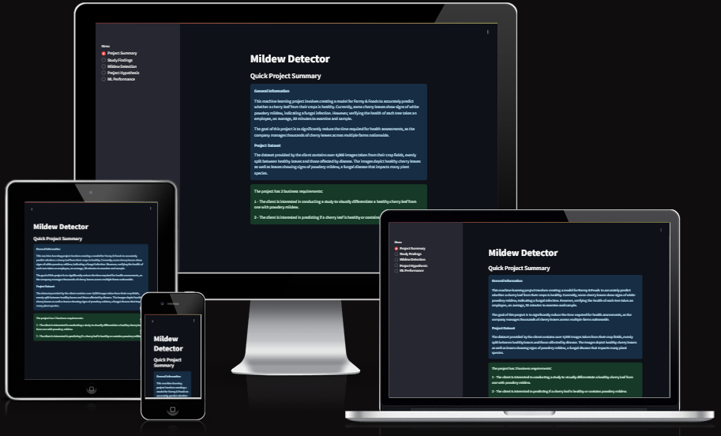
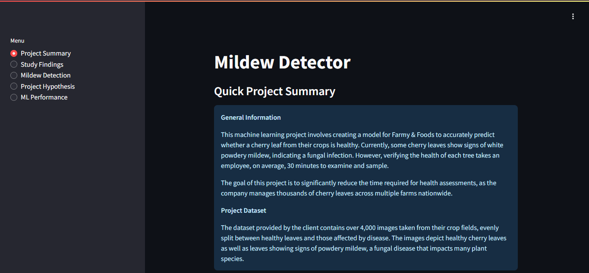
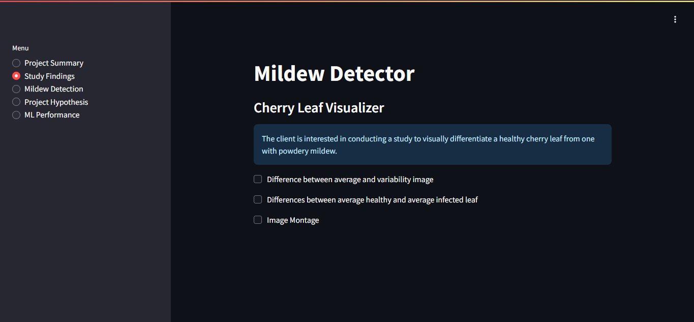
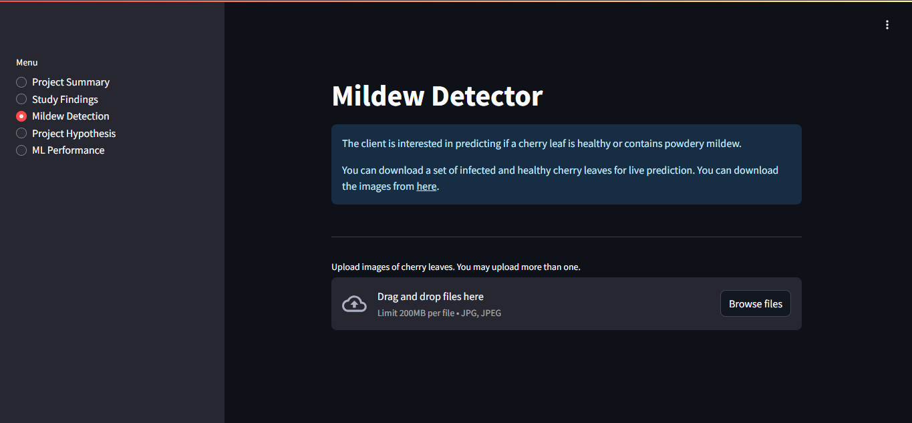
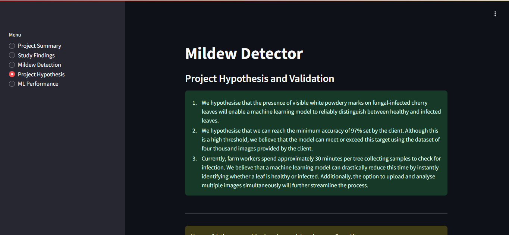
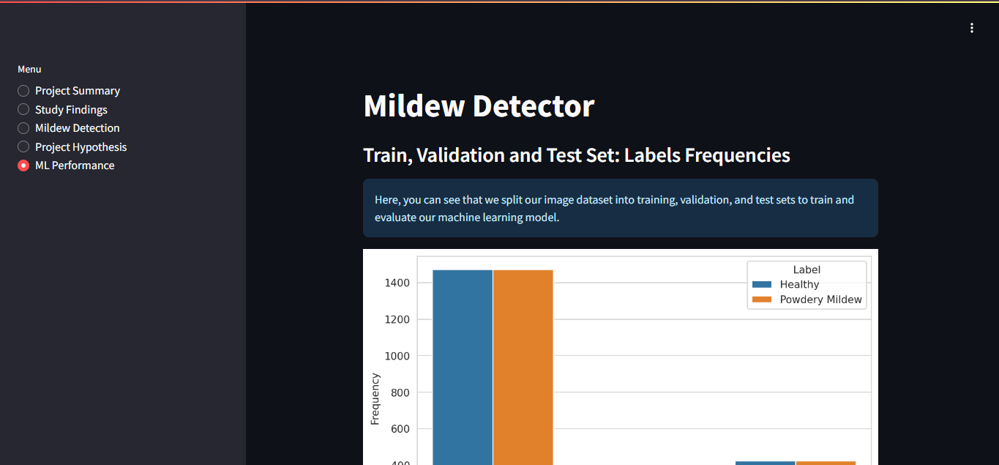

# Mildew detection in cherry leaves

## Dataset Content

 - The dataset is sourced from [Kaggle](https://www.kaggle.com/codeinstitute/cherry-leaves). We then created a fictitious user story where predictive analytics can be applied in a real project in the workplace.
 - The dataset contains +4 thousand images taken from the client's crop fields. The images show healthy cherry leaves and cherry leaves that have powdery mildew, a fungal disease that affects many plant species. The cherry plantation crop is one of the finest products in their portfolio, and the company is concerned about supplying the market with a compromised quality product.

## Business Requirements

The cherry plantation crop from Farmy & Foods is facing a challenge where their cherry plantations have been presenting powdery mildew. Currently, the process is manual verification if a given cherry tree contains powdery mildew. An employee spends around 30 minutes in each tree, taking a few samples of tree leaves and verifying visually if the leaf tree is healthy or has powdery mildew. If there is powdery mildew, the employee applies a specific compound to kill the fungus. The time spent applying this compound is 1 minute. The company has thousands of cherry trees located on multiple farms across the country. As a result, this manual process is not scalable due to the time spent in the manual process inspection.

To save time in this process, the IT team suggested an ML system that detects instantly, using a leaf tree image, if it is healthy or has powdery mildew. A similar manual process is in place for other crops for detecting pests, and if this initiative is successful, there is a realistic chance to replicate this project for all other crops. The dataset is a collection of cherry leaf images provided by Farmy & Foods, taken from their crops.

 - 1 - The client is interested in conducting a study to visually differentiate a healthy cherry leaf from one with powdery mildew.
 - 2 - The client is interested in predicting if a cherry leaf is healthy or contains powdery mildew.

## Hypothesis and how to validate?

1. We hypothesise that the presence of visible white powdery marks on fungal-infected cherry leaves will enable a machine learning model to reliably distinguish between healthy and infected leaves.

2. We hypothesise that we can reach the minimum accuracy of 97% set by the client. Although this is a high threshold, we believe that the model can meet or exceed this target using the dataset of four thousand images provided by the client.

3. Currently, farm workers spend approximately 30 minutes per tree collecting samples to check for infection. We believe that a machine learning model can drastically reduce this time by instantly identifying whether a leaf is healthy or infected. Additionally, the option to upload and analyse multiple images simultaneously will further streamline the process.

 - Validation of these hypotheses will involve evaluating the model using graphical analysis and subsequent testing. This process will include assessing the model's accuracy and loss over epochs.

 - After validation, the client should be able to use images of future crops in conjunction with the model to accurately identify healthy leaves and those with powdery mildew. This will significantly reduce the time required for manual inspection and allow for targeted treatment of infected leaves.

## The rationale to map the business requirements to the Data Visualisations and ML tasks 

1. Business Requirement 1: Data Visualization
 - As a client I want to display the "mean" and "standard deviation" images for cherry leaves that are healthy and cherry leaves that contain powdery mildew, so that I can visually differentiate cherry leaves.
 - As a client I want to display the difference between an average cherry leaf that is healthy and a cherry leaf that contains powdery mildew, so that I can visually differentiate cherry leaves.
 - As a client I want to display an image montage for cherry leaves that are healthy and cherry leaves that contain powdery mildew, so that I can  visually differentiate cherry leaves.

2. Business Requirement 2: Classification
 - As a client I want to predict if a given cherry leaf is healthy or contains powdery mildew.
 - As a client I want to upload multiple images for the ML model to make accurate predictions which can be downloaded to action targeted treatments.

## ML Business Case

We aim to develop a machine learning model capable of predicting whether a given cherry leaf is healthy or affected by powdery mildew, using a dataset provided by the client. The primary objective is to reduce the time employees spend identifying fungal infections in cherry trees. The success criterion for the model is achieving an accuracy of 97% or higher. The model will function as a binary classifier, providing predictions based on uploaded images to a dashboard provided to the client.

### Current Process and Challenges
The current process involves manually inspecting each tree, which takes approximately 30 minutes per tree. Employees collect samples to visually verify whether the leaves are healthy or infected with powdery mildew. If a tree is found to be infected, a specific compound is applied to eliminate the fungus, a task that typically takes about a minute per tree. Given that the company manages thousands of trees across multiple farms nationwide, this process consumes thousands of hours and demands a more efficient solution.

### Dataset and Privacy Measures
The dataset provided contains over 4,000 images of leaves from the client’s crops, with an even distribution between healthy and infected leaves. This dataset has been preprocessed and divided into training, validation, and test sets for model development. The data was shared under a non-disclosure agreement (NDA) and is subject to strict privacy and protection measures to ensure compliance with confidentiality requirements.

## Dashboard Design

### Page 1: Project Summary
 - This page will provide a summary of the project, the dataset and also the business requirements.

### Page 2: Study Findings
 - This page will present our findings from the study, including visual representations of the differences between healthy cherry leaves and those affected by powdery mildew. The different between the average and variability images will be shown as well as the difference between the average healthy and average infected leaf. There will also be an image montage for both sets of leaves. 
 - This will answer business requirement 1. (The client is interested in conducting a study to visually differentiate a healthy cherry leaf from one with powdery mildew.)

### Page 3: Mildew Detector
 - This page will include a link to download a set of cherry leaf images for live predictions.
 - It will feature a widget that allows users to upload images, with support for multiple uploads at once. The uploaded images will be displayed alongside a prediction statement indicating whether each leaf is healthy or infected, along with the associated probability score.
 - A table will also be included to list each image and its prediction results, along with a button to download the table and its data.
 - This will answer business requirement 2. (The client is interested in predicting if a cherry leaf is healthy or contains powdery mildew.)

### Page 4: Project Hypothesis
 - This page will outline the project hypotheses and detail how they were validated during the course of the project.

### Page 5: Model Performance
 - This page will display the performance metrics of our model, including accuracy, loss over epochs, and other relevant evaluation results.

## Unfixed Bugs

- There are no unfixed bugs.

## Deployment

### Render

- The App live link is: `https://cherry-leaves-2nkh.onrender.com`
- The project was deployed to Render using the following steps.

1. Log in to Render and create an web service.
2. Connect your repository from GitHub.
3. Give your new app a name and complete the Build and Start Command. 
4. Add in your environment variables for PORT and PYTHON_VERSION. 
5. Click on "Create Web Service" and once the build has completed you will be able view your new website.

## Main Data Analysis and Machine Learning Libraries

List of the libraries used in the project

- [NumPy](https://numpy.org/) - Processing of images via conversion to NumPy arrays. Many other libraries used in this project are also dependent on NumPy
- [Pandas](https://pandas.pydata.org/) - Conversion of numerical data into DataFrames to facilitate functional operations
- [Matplotlib](https://matplotlib.org/) - Reading, processing, and displaying image data, producing graphs of tabular data
- [Seaborn](https://seaborn.pydata.org/) - Data visualisation and presentation, such as the confusion matrix heatmap and image dimensions scatter plot.
- [Plotly](https://plotly.com/python/) - Graphical visualisation of data, used in particular on dashboard for interactive charts
- [TensorFlow](https://www.tensorflow.org/versions/r2.6/api_docs/python/tf) - Machine learning library used to build model
- [Keras Tuner](https://keras.io/keras_tuner/) - Tuning of hyperparameters to find best combination for model accuracy
- [Scikit-learn](https://scikit-learn.org/) - Calculating class weights to handle target imbalance and generating classification report
- [PIL Image](https://pillow.readthedocs.io/en/stable/reference/Image.html) - Used for image manipulation (src)
- [Streamlit](https://streamlit.io/) - Development of dashboard for presentation of data and project delivery
- [Render](https://render.com/) - Deployment of dashboard as web application
- [Git/GitHub](https://github.com/) - Version control and storage of source code
- [Am I Responsive App](https://ui.dev/amiresponsive) - To produce the main project screenshot

## Testing

### Validation

## Credits

- Through the whole process of making this app I was closely following the Code Institute's walkthrough for Malaria Detection and also other content provided by Code Institute.